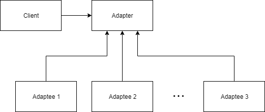

The Adapter design pattern is a method of constructing a wrapper around a pre-existing interface to allow its use by another class.
We can construct an individual adapter for a specific class, or create an abstract interface to base our adapter on.
An abstract interface will allow us to swap out our adapter for any class that inherits from the interface.

An adapter is most useful in two differenct scenarios.
The first is when you would like to re-use pre-existing code that has been rigorously tested without modifying it and thus invalidating the tests.
The second is when you would like to create code that cares more about getting correct results for a set of inputs than how those results are generated.
You may want to create a set of libraries that can generate the results, but you do not want to re-write your main class to suit each new library.
The structure of an Adapter is shown in the figure below.

As an example, consider the situation where we would like to read a Molecular Dynamics (MD) trajectory from a PDB file and perform some analysis on it.
We currently have an MD library in mind to use, but we may want to use one or more different libraries in the future.
If we do not want to re-write our code for each individual library, we need to come up with a different solution, in this case it will be to create an adapter.
We will use two MD libraries, [MDAnalysis] and [MDTraj] in this example.
We will also be using [NumPy] to structure some of our data.

First, we will import the libraries we want to use.
~~~
import numpy as np
import MDAnalysis
import mdtraj as md
~~~
{: .language-python}

Based on SOLID design principles, we want to code towards an interface, not a specific class, so we want to create an interface to base our adapters on.
We will use Python's [abc] module to help build the interface, so we will need to import it and build our interface.
~~~
from abc import abstractmethod, ABC

class TrajectoryAdapter(ABC):
    @abstractmethod
    def compute_center_of_mass():
        pass
		
    @abstractmethod
    def compute_radius_of_gyration():
        pass
~~~
{: .language-python}
Inheriting from ABC and decorating the methods with `@abstractmethod` ensures that any subclass of TrajectoryAdapter must override both methods.
Any code developed using the listed abstract methods from the interface will now work with any adapter we construct that inherits from `TrajectoryAdapter`.
> ## Inheritance
> Inheritance is the principle of extending a class to add capabilities without modifying the original class.
> We call the class that is being inherited the parent, and the class that is inheriting the child.
> The child class obtains the properties and behaviors of its parent unless it overrides them.
{: .callout}

We will start by building an Adapter that utilizes MDTraj.
~~~
class MDTrajAdapter(TrajectoryAdapter):
    def __init__(self, filename):
        self.trajectory = md.load_pdb(filename)
        print('Selected MDTraj.')
~~~
{: .language-python}
Here we define the class with a constructor that takes in the name of our PDB file.
We construct a trajectory object by using the `load_pdb(filename)` method from the MDTraj library.
To help determine that we are using the correct adapter, we include a simple print statement informing the User that the MDTraj library is selected.

Since both methods in `TrajectoryAdapter` are abstract methods, we must override them.
First we will implement the `compute_center_of_mass` function.
~~~
    def compute_center_of_mass(self):
        return 10 * md.compute_center_of_mass(self.trajectory)
~~~
{: .language-python}
We utilize the `compute_center_of_mass` from MDTraj with our trajectory.
The code interested in performing these calculations wants to use &#197;ngstr&#246;ms, but MDTraj uses nanometers, so we need to do a quick conversion of our results.
~~~
    def compute_radius_of_gyration(self):
        return 10 * md.compute_rg(self.trajectory)
~~~
{: .language-python}
We similarly implement the `compute_radius_of_gyration` method and perform the unit conversion.

We can now use our MDTrajAdapter to calculate the center of mass and radius of gyration of a given trajectory.
Using the PDB file provided in the setup section, we can test our code.
~~~
mda = MDTrajAdapter('protein.pdb')
print(f'Center of mass:\n{mda.compute_center_of_mass()}')
print(f'Radius of Gyration:\n{mda.compute_radius_of_gyration()}')
~~~
{: .language-python}
~~~
Selected MDTraj.
Center of mass:
 [[26.76820533 23.59637797 25.03325893]
 [26.53429267 24.03360343 25.02484501]
 [27.35986206 24.40050269 24.91180938]]
Radius of Gyration:
 [12.05981914 12.17911312 12.1806974 ]
~~~
{: .output}

We would like to change the library we are using to MDAnalysis without adjusting the function calls.
First, we will construct another Adapter for MDAnalysis.
~~~
class MDAnalysisAdapter(TrajectoryAdapter):
    def __init__(self, filename):
        self.trajectory = MDAnalysis.Universe(filename)
        print('Selected MDAnalysis.')
~~~
{: .language-python}
Here we define the class with a constructor that takes in the name of our PDB file.
We construct a trajectory object by using the `Universe(filename)` method from the MDAnalysis library.

Since both methods in `TrajectoryAdapter` are abstract methods, we must override them.
First we will implement the `compute_center_of_mass` function.
~~~
    def compute_center_of_mass(self):
        mass_by_frame = np.ndarray(shape=(len(self.trajectory.trajectory), 3))
        for ts in self.trajectory.trajectory:
            mass_by_frame[ts.frame] = self.trajectory.atoms.center_of_mass(compound='segments')
        return mass_by_frame
~~~
{: .language-python}
Since our code is looking for an ndarray from NumPy, we need to ensure that the return type of the functions using MDAnalysis are also in ndarrays.
We would like to see the result returned as a 2-dimensional array of tuples containing the coordinates of the center of mass in each frame, so we construct our array using NumPy.
We then iterate through the timesteps of our trajectory and calculate the center of mass of the atoms during that frame, adding the result to our array.

We will similarly implement the `compute_radius_of_gyration` function.
~~~
    def compute_radius_of_gyration(self):
        rg_by_frame = np.empty(len(self.trajectory.trajectory))
        for ts in self.trajectory.trajectory:
            rg_by_frame[ts.frame] = self.trajectory.atoms.radius_of_gyration()
        return rg_by_frame
~~~
{: .language-python}

It is important to notice that the constructor and the method calls have the same definition as those in the MDTraj and perform the same operations, with the same return types, but do so in a different way.
To an external class, the two Adapters are now interchangable.
We will run the same test with the only difference being the adapter we use.
~~~
mda = MDAnalysisAdapter('protein.pdb')
print(f'Center of mass:\n{mda.compute_center_of_mass()}')
print(f'Radius of Gyration:\n{mda.compute_radius_of_gyration()}')
~~~
{: .language-python}
~~~
Selected MDAnalysis.
Center of mass:
 [[26.7681786  23.59642783 25.03328876]
 [26.53426535 24.03365348 25.02487714]
 [27.35982618 24.40054767 24.91184063]]
Radius of Gyration:
 [11.90080871 12.02935585 12.03777011]
~~~
{: .output}

With adapters for each library, our code is not concerned with how the data it needs is generated, simply that it follows the contract put in place by the interface.



[MDAnalysis]: https://www.mdanalysis.org/
[MDTraj]: http://mdtraj.org/1.9.0/
[NumPy]: http://www.numpy.org/
[abc]: https://docs.python.org/3/library/abc.html
