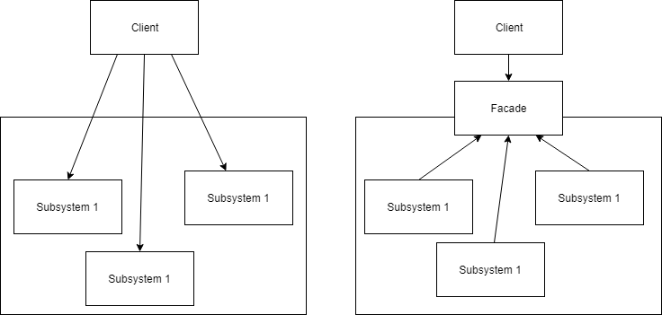

The Facade design pattern is used to simplify the interface to a subsystem.

We will continue using the Molecular Dynamics (MD) packages [MDTraj] and [MDAnalysis] to showcase a simple example Facade.
Consider the scenario where you have a consistent workflow that you want to apply to trajectories read from PDB files. You may have many different trajectories, but for each one we have the same set of analysis functions we wish to run.
In addition, we want to use computations from a number of different packages, complicated the execution of the workflow.
We will use the Facade design pattern to hide the complexity of the computation behind a simple, easy to use interface.

Like with the Adapter design pattern, we need to import the packages we wish to use.
~~~
import numpy as np
import MDAnalysis
import mdtraj as md
~~~
{: .language-python}

We then consider the classes we are using to perform our computations.
For simplicity, we will use slightly modified versions of the Adapter classes from the Adapter design pattern example.
~~~
class MDAnalysisTrajectoryHandler:
    def __init__(self, filename):
        self.trajectory = MDAnalysis.Universe(filename)
	
    def compute_center_of_mass(self):
        mass_by_frame = np.ndarray(shape=(len(self.trajectory.trajectory), 3))
        for ts in self.trajectory.trajectory:
            mass_by_frame[ts.frame] = self.trajectory.atoms.center_of_mass(compound='segments')
        return mass_by_frame
	
    def compute_radius_of_gyration(self):
        rg_by_frame = np.empty(len(self.trajectory.trajectory))
        for ts in self.trajectory.trajectory:
            rg_by_frame[ts.frame] = self.trajectory.atoms.radius_of_gyration()
        return rg_by_frame
		
		
class MDTrajTrajectoryHandler:
    def __init__(self, filename):
        self.trajectory = md.load_pdb(filename)
	
    def compute_center_of_mass(self):
        return 10 * md.compute_center_of_mass(self.trajectory)
	
    def compute_radius_of_gyration(self):
        return 10 * md.compute_rg(self.trajectory)
~~~
{: .language-python}
If we wanted to use various functions to perform our compute workflow, we would need to construct an object of each class and execute the relevant methods.
Instead, we are going to construct a Facade to handle it for us.
~~~
class TrajectoryAnalyzer:
    def __init__(self, filename):
        self.mda = MDAnalysisTrajectoryHandler(filename)
        self.mdt = MDTrajTrajectoryHandler(filename)
~~~
{: .language-python}
The constructor for our Facade takes a filename, the path to the PDB file, and creates and instance of each Handler file.
Since we have a consistent workflow that we want to use, we will create a function that executes it based on the given input file.
~~~
    def analysis(self):
        results = {}
        results['MDAnalysis_center_of_mass'] = self.mda.compute_center_of_mass()
        results['MDTraj_radius_of_gyration'] = self.mdt.compute_radius_of_gyration()
        return results
~~~
{: .language-python}
The analysis function executes our workflow on the trajectory and returns a dictionary.
~~~
trajectory_analysis = TrajectoryAnalyzer('protein.pdb')
print(trajectory_analysis.analysis())
~~~
{: .language-python}
~~~
{'MDAnalysis_center_of_mass': array([[26.7681786 , 23.59642783, 25.03328876],
       [26.53426535, 24.03365348, 25.02487714],
       [27.35982618, 24.40054767, 24.91184063]]), 'MDTraj_radius_of_gyration': array([12.05981914, 12.17911312, 12.1806974 ])}
~~~
{: .output}


[MDAnalysis]: https://www.mdanalysis.org/
[MDTraj]: http://mdtraj.org/1.9.0/
[NumPy]: http://www.numpy.org/
[abc]: https://docs.python.org/3/library/abc.html
