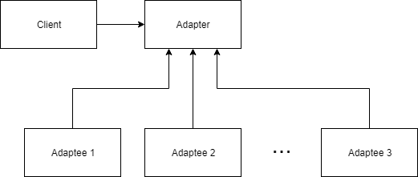

The Adapter design pattern is a method of constructing a wrapper around a pre-existing interface to allow its use by another class.
We can construct an individual adapter for a specific class, or create an abstract interface to base our adapter on.
An abstract interface will allow us to swap out our adapter for any class that inherits from the interface.

An adapter is most useful in two differenct scenarios.
The first is when you would like to re-use pre-existing code that has been rigorously tested without modifying it and thus invalidating the tests.
The second is when you would like to create code that cares more about getting correct results for a set of inputs than how those results are generated.
You may want to create a set of libraries that can generate the results, but you do not want to re-write your main class to suit each new library.
The structure of an Adapter is shown in the figure below.

As an example, consider the situation where we would like to read a Molecular Dynamics (MD) trajectory from a PDB file and perform some analysis on it.
We currently have an MD library in mind to use, but we may want to use one or more different libraries in the future.
If we do not want to re-write our code for each individual library, we need to come up with a different solution, in this case it will be to create an adapter.
We will use two MD libraries, [MDAnalysis] and [MDTraj] in this example. Our goal is to create a code that uses MDTraj or MDAnalysis to perform some simple analysis on a trajectory file. To keep the runtime short, we will only use the center of mass and the radius of gyration from each code, but the concepts shown will apply to more in depth computations.
A sample trajectory file to use was provided in PDB form in the Setup instructions.
We will also be using [NumPy] to structure some of our data.

## Trajectory Analysis Script

To start, let us consider how we would these libraries without an adapter. We would first pick a library to start with, in this case MDTraj.
We begin by importing the libraries we want to use.
~~~
import mdtraj as mdt
~~~
{: .language-python}

To load a PDB file in MDTraj, we use the `load_pdb` function. We can then use the functions from MDTraj to perform our two computations.

~~~
trajectory = mdt.load_pdb('protein.pdb')

print(f'Center of mass: \n{mdt.compute_center_of_mass(trajectory)}')
print(f'Radius of Gyration: \n{mdt.compute_rg(trajectory)}')
~~~
{: .language-python}

Running this script should provide the following output:
~~~
Center of mass:
[[2.67682053 2.3596378  2.50332589]
 [2.65342927 2.40336034 2.5024845 ]
 [2.73598621 2.44005027 2.49118094]]
Radius of Gyration:
[1.20598191 1.21791131 1.21806974]
~~~
{: .output}

Now let us consider that we want to change the library we are using for analysis. Let us quickly change the code to use MDAnalysis to load the PDB and perform our two computations.
~~~
#import mdtraj as mdt
import MDAnalysis as mda

#trajectory = mdt.load_pdb('protein.pdb')
trajectory = mda.Universe('protein.pdb')

#print(mdt.compute_center_of_mass(trajectory))
#print(mdt.compute_rg(trajectory))
print(f'Center of mass: \n{trajectory.atoms.center_of_mass(compound="segments")}')
print(f'Radius of Gyration: \n{trajectory.atoms.radius_of_gyration()}')
~~~
{: .language-python}

The first thing to notice is that the two libraries handle the operations very differently. The function definitions are completely distinct from one another. Any code that is utilizing the center of mass and radius of gyration from MDTraj may have to make significant changes to update the analysis library.
Lets take a look at the output of the above code.
~~~
Center of mass:
[[26.7681786  23.59642783 25.03328876]]
Radius of Gyration:
11.90080870784717
~~~
{: .language-python}

We can see that not only are the function definitions different, both the output structure and the units are different. MDTraj is outputting in nanometers and MDAnalysis is using &#197;ngstr&#246;ms. Lets use &#197;ngstr&#246;ms moving forward, but we want the same output structure from MDTraj. We will need a little help from [NumPy], so be sure to import it.

~~~
#import mdtraj as mdt
import MDAnalysis as mda
import numpy as np

#trajectory = mdt.load_pdb('protein.pdb')
trajectory = mda.Universe('protein.pdb')

#print(mdt.compute_center_of_mass(trajectory))
#print(mdt.compute_rg(trajectory))

mass_by_frame = np.ndarray(shape=(len(trajectory.trajectory), 3))
for ts in trajectory.trajectory:
    mass_by_frame[ts.frame] = trajectory.atoms.center_of_mass(compound='segments')
print(f'Center of mass: \n{mass_by_frame}')

rg_by_frame = np.empty(len(trajectory.trajectory))
for ts in trajectory.trajectory:
    rg_by_frame[ts.frame] = trajectory.atoms.radius_of_gyration()
print(f'Radius of Gyration: \n{rg_by_frame}')
~~~
{: .language-python}

This will provide us with the output in the desired form.

~~~
Center of mass:
[[26.7681786  23.59642783 25.03328876]
 [26.53426535 24.03365348 25.02487714]
 [27.35982618 24.40054767 24.91184063]]
Radius of Gyration:
[11.90080871 12.02935585 12.03777011]
~~~
{: .output}

This was a very simple script, but replacing the libraries has cost us a fair bit of effort. If we had put some thought into it from the beginning, we could have created an abstraction layer to protect our code from changes like these. This is where the adapter design pattern will come in.

## Trajectory Adapter 

Based on SOLID design principles, we want to code towards an interface, not a specific class, so we want to create an interface to base our adapters on.
We will use Python's [abc] module to help build the interface, so we will need to import it and build our interface. We create a new file called `trajectoryAdapter.py` to hold our adapter.
~~~
from abc import abstractmethod, ABC

class TrajectoryAdapter(ABC):
    @abstractmethod
    def compute_center_of_mass():
        pass

    @abstractmethod
    def compute_radius_of_gyration():
        pass
~~~
{: .language-python}
Inheriting from ABC and decorating the methods with `@abstractmethod` ensures that any subclass of TrajectoryAdapter must override both methods.
Any code developed using the listed abstract methods from the interface will now work with any adapter we construct that inherits from `TrajectoryAdapter`.

> ## Inheritance
> Inheritance is the principle of extending a class to add capabilities without modifying the original class.
> We call the class that is being inherited the parent, and the class that is inheriting the child.
> The child class obtains the properties and behaviors of its parent unless it overrides them.
{: .callout}

## MDTraj Adapter

We will start by building an Adapter that utilizes MDTraj. We create a new file called `mdtra_adapter.py`. Remember to import the adapter and mdtraj.
~~~
from trajectoryAdapter import TrajectoryAdapter
import mdtraj as mdt

class MDTrajAdapter(TrajectoryAdapter):
    def __init__(self, filename):
        self.trajectory = md.load_pdb(filename)
        print('Selected MDTraj.')
~~~
{: .language-python}

Here we define the class with a constructor that takes in the name of our PDB file.
We construct a trajectory object by using the `load_pdb(filename)` method from the MDTraj library.
To help determine that we are using the correct adapter, we include a simple print statement informing the User that the MDTraj library is selected.

Since both methods in `TrajectoryAdapter` are abstract methods, we must override them.
First we will implement the `compute_center_of_mass` function.
~~~
    def compute_center_of_mass(self):
        return 10 * md.compute_center_of_mass(self.trajectory)
~~~
{: .language-python}
We utilize the `compute_center_of_mass` from MDTraj with our trajectory.
Our code is interested in performing these calculations using &#197;ngstr&#246;ms, but MDTraj uses nanometers, so we need to do a quick conversion of our results.
~~~
    def compute_radius_of_gyration(self):
        return 10 * md.compute_rg(self.trajectory)
~~~
{: .language-python}
We similarly implement the `compute_radius_of_gyration` method and perform the unit conversion.

We can now use our MDTrajAdapter to calculate the center of mass and radius of gyration of a given trajectory.
Using the sample trajectory, we edit our script to use the adapter.
~~~
from mdtraj_adapter import MDTrajAdapter

mda = MDTrajAdapter('protein.pdb')
print(f'Center of mass:\n{mda.compute_center_of_mass()}')
print(f'Radius of Gyration:\n{mda.compute_radius_of_gyration()}')
~~~
{: .language-python}
~~~
Selected MDTraj.
Center of mass:
 [[26.76820533 23.59637797 25.03325893]
 [26.53429267 24.03360343 25.02484501]
 [27.35986206 24.40050269 24.91180938]]
Radius of Gyration:
 [12.05981914 12.17911312 12.1806974 ]
~~~
{: .output}

## MDAnalysis Adapter

Now we would like to change our code to use the MDAnalysis library, ideally with minimal impact on our script, which is simulating a larger code.
Let us construct another Adapter for MDAnalysis. Create a new file called `mdanalysis_adapter.py` and include the imports.
~~~
from trajectoryAdapter import TrajectoryAdapter
import MDAnalysis as mda
import numpy as np

class MDAnalysisAdapter(TrajectoryAdapter):
    def __init__(self, filename):
        self.trajectory = MDAnalysis.Universe(filename)
        print('Selected MDAnalysis.')
~~~
{: .language-python}
Here we define the class with a constructor that takes in the name of our PDB file.
We construct a trajectory object by using the `Universe(filename)` method from the MDAnalysis library.

Since both methods in `TrajectoryAdapter` are abstract methods, we must override them.
First we will implement the `compute_center_of_mass` function.
~~~
    def compute_center_of_mass(self):
        mass_by_frame = np.ndarray(shape=(len(self.trajectory.trajectory), 3))
        for ts in self.trajectory.trajectory:
            mass_by_frame[ts.frame] = self.trajectory.atoms.center_of_mass(compound='segments')
        return mass_by_frame
~~~
{: .language-python}
Since our code is looking for an ndarray from NumPy, we need to ensure that the return type of the functions using MDAnalysis are also in ndarrays.
We would like to see the result returned as a 2-dimensional array of tuples containing the coordinates of the center of mass in each frame, so we construct our array using NumPy.
We then iterate through the timesteps of our trajectory and calculate the center of mass of the atoms during that frame, adding the result to our array.

We will similarly implement the `compute_radius_of_gyration` function.
~~~
    def compute_radius_of_gyration(self):
        rg_by_frame = np.empty(len(self.trajectory.trajectory))
        for ts in self.trajectory.trajectory:
            rg_by_frame[ts.frame] = self.trajectory.atoms.radius_of_gyration()
        return rg_by_frame
~~~
{: .language-python}

It is important to notice that the constructor and the method calls have the same definition as those in the MDTraj and perform the same operations, with the same return types, but do so in a different way.
To an external class, the two Adapters are now interchangable.
We will update our script to use the MDAnalysisAdapter instead.
~~~
#from mdtraj_adapter import MDTrajAdapter
from mdanalysys_adapter import MDAnalysisAdapter

#mda = MDTrajAdapter('protein.pdb')
mda = MDAnalysisAdapter('protein.pdb')
print(f'Center of mass:\n{mda.compute_center_of_mass()}')
print(f'Radius of Gyration:\n{mda.compute_radius_of_gyration()}')
~~~
{: .language-python}
~~~
Selected MDAnalysis
Center of mass:
[[26.7681786  23.59642783 25.03328876]
 [26.53426535 24.03365348 25.02487714]
 [27.35982618 24.40054767 24.91184063]]
Radius of Gyration:
[11.90080871 12.02935585 12.03777011]
~~~
{: .output}

With adapters for each library, our code is not concerned with how the data it needs is generated, simply that it follows the contract put in place by the interface.



[MDAnalysis]: https://www.mdanalysis.org/
[MDTraj]: http://mdtraj.org/1.9.0/
[NumPy]: http://www.numpy.org/
[abc]: https://docs.python.org/3/library/abc.html
